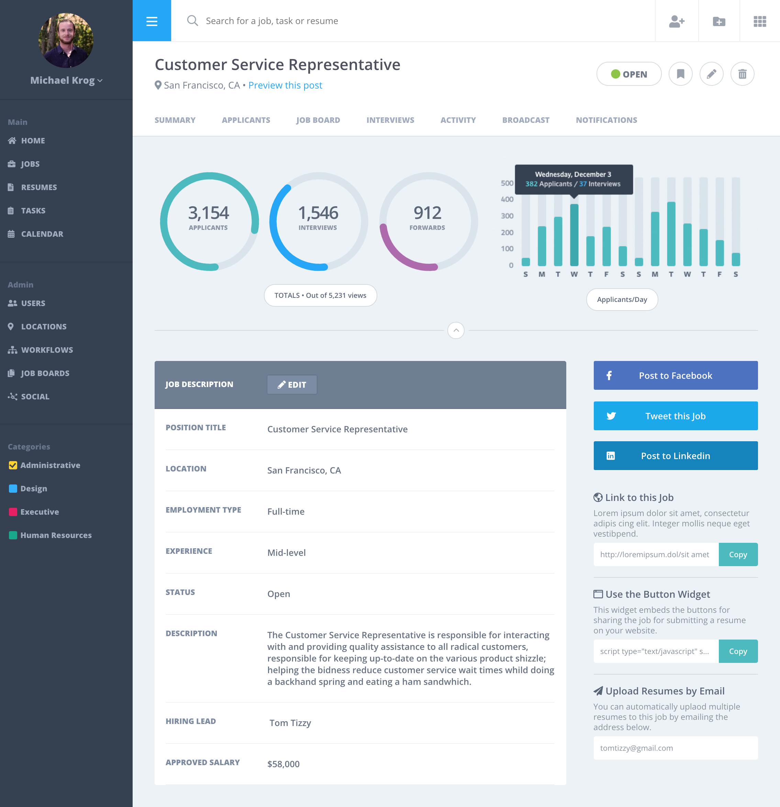

# Static Composition 2

## Project Description
> The static comp challenge is a series of three challenges to keep working that HTML/CSS. I was asked to recreate a static comp. The objective is to build something that respects the integrity of the original design and expand upon the copy, images and colors.

## Built With
This project was build with the following
- HTML
- CSS
- Javascript

## Practice Description
> In this project I worked with flex boxes in a very
complex landing page. As well I build a custom side nav bar that can open and close at the users choice. Additionally I worked with svg circles and the custom ranges of each.

### Static Composition

### My Assignment Screen Grab

